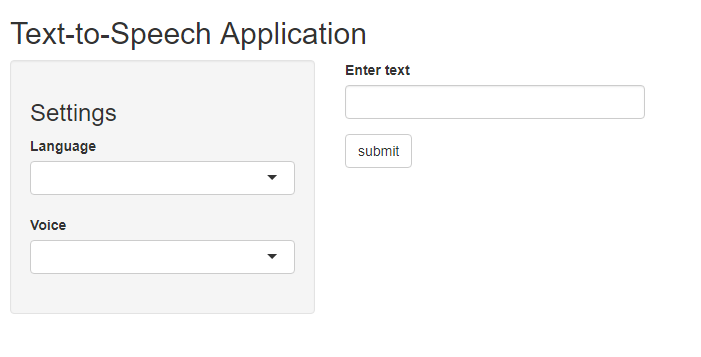

```{r setup, include=FALSE}
library(magrittr)
library(curl)
library(jsonlite)

library(tuneR)

tts.url = Sys.getenv("TEXT_TO_SPEECH_URL")
tts.apikey = Sys.getenv("TEXT_TO_SPEECH_APIKEY")

knitr::opts_chunk$set(echo = FALSE)


audio_player <- function(audio,
                         html = "player.html"){
  writeLines(sprintf('<html><body>
    <audio controls autoplay>
                     <source src="%s">
                     </audio>
                     </body></html>',
              audio),
      html)
}
```

## IBM Watson Text-to-Speech API

 and [IBM Watson TTS API](https://cloud.ibm.com)](images/WatsonAPI.png)

## Features

- several languages (ar, de, en-AU, en-GB, en-US, es-ES, es-LA, es-US, fr-CA, fr-FR, it, ja, ko, nl-BE, nl-NL, pt, zh)
- one or more different voices (male and female) for every language

## User interface



To get started, select the language and one of the available voices in the settings panel. Then enter the text in the window on the right and click the "submit" button.

## Example of a Curl request

```{r, echo=TRUE}
url <- paste0(tts.url, "/v1/synthesize?voice=en-US_AllisonVoice")
postfields <- toJSON(list(text = "Hello World!"), auto_unbox = TRUE)
handle <- new_handle(url = url) %>%
    handle_setopt(
        "userpwd" = paste0("apikey", ":", tts.apikey),
        "postfields" = postfields
    ) %>%
    handle_setheaders(
        "Content-Type" = "application/json",
        "Accept" = "audio/ogg;codecs=opus"
    )
path <- file.path("www", "number1.wav")
curl_download(url, path, handle = handle)
audio_player(path)
```

<iframe src="player.html"></iframe>

## Thank you
